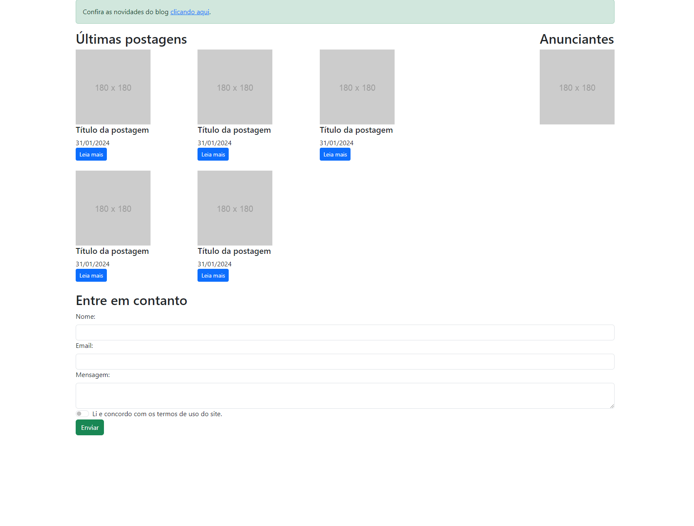

# Online Contact List


This application explores the use of Bootstrap to implement and style a simple design for a blog like site with a form. 

## Index
- <a href="#run">How to run the application</a>
- <a href="#tecnologies-used">Tecnologies used</a>
- <a href="#developer">Developer</a>

## How to run the application
```bash
# Clone this repository
$ git clone repolink

# Acess the app folder on your terminal
$ cd contact-list

# Utilize a local server launch tool to view the application in your browser

```

## Tecnologies used
1. HTML
2. CSS
3. Bootstrap

## Developer
[LinkedIn](https://www.linkedin.com/in/julia-silva-borges/)